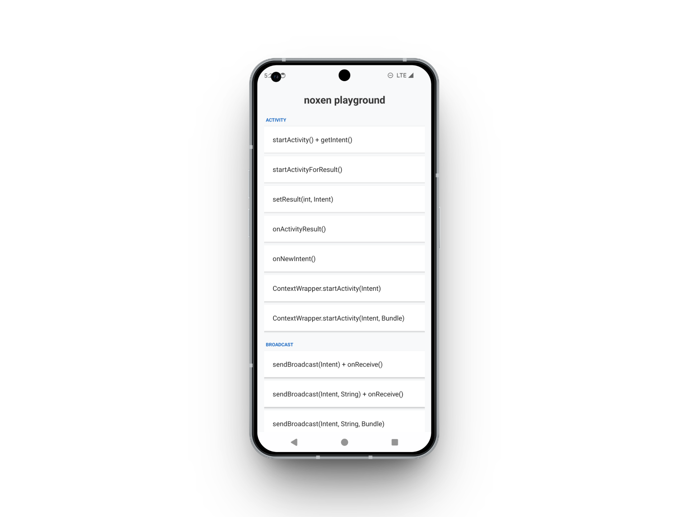

# noxen playground

`noxen playground` is the Android target app used to validate noxen during local
development and testing.

The app intentionally exposes buttons that exercise common Android communication
surfaces:



- Activity launch and result flows
- BroadcastReceiver and ordered broadcast flows
- Service and bindService flows
- PendingIntent creation paths
- Concurrent broadcasts from multiple threads
- Explicit and implicit attack-surface examples

## Build and run with noxen

Build the app:

```bash
./gradlew assembleDebug
```

Install it on a connected device, then launch noxen:

```bash
noxen
```

From the Home tab, select the device, choose **Spawn** mode, and select package
`com.frankheat.noxen.playground`. If the app is already running, use **Attach
(app name)** with `noxen playground`.

## Android Studio

Open this directory directly:

```text
noxen-playground/
```

## App identity

- App label: `noxen playground`
- Package: `com.frankheat.noxen.playground`

## License

`noxen playground` is released under the [MIT License](LICENSE).
